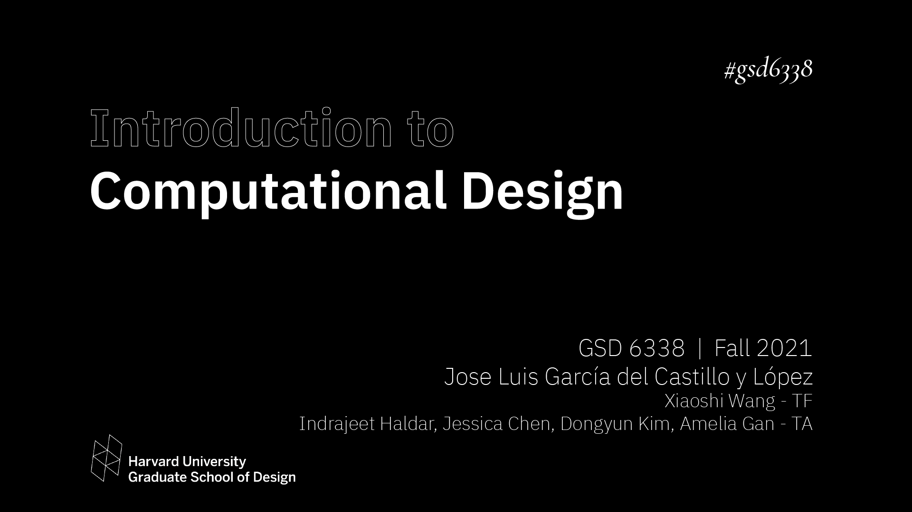
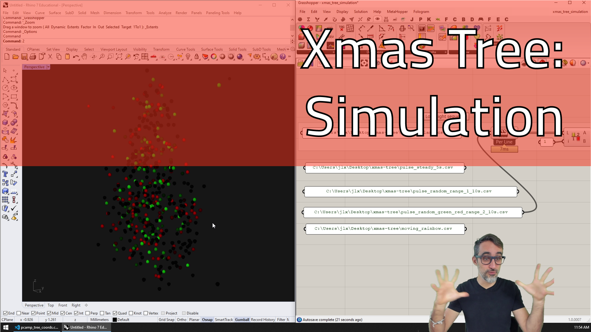

# Computational Xmas Tree

This repo contains the code for the computational illumination of a Christmas Tree! 

It is based on the work by Matt Parker from [@standupmaths](https://github.com/standupmaths/), and his video ["I wired my tree with 500 LED lights and calculated their 3D coordinates"](https://www.youtube.com/watch?v=TvlpIojusBE). 

This version contains an original LED 3D calibration routine developed by [@range-et](https://github.com/range-et) based on Matt's explanations on the video, Grasshopper + C# scripts to generate animated light sequences developed by [@garciadelcastillo](https://github.com/garciadelcastillo), and python scripts for the Raspberry Pi to load and run them on the tree.

The main difference is that Matt's approach uses custom Python scripts with sequences ran directly on the RPi, whereas this workflow "bakes" the animations to `CSV` files that can then be ran from the RPi. The advantage of this approach is that the CSV sequences can be parsed on any graphics environment and displayed/simulated without needing to compile Python code. The downside is that the coordinates of the LEDs need to be known _a priori_ before generating the CSV file (CSV files become _tree-specific_).

Jose Luis did a video series on [ParametricCamp](https://www.youtube.com/channel/UCSgG9KzVsS6jArapCx-Bslg) explaining (most of) this workflow: [https://youtu.be/ma4JF6b4Dqk](https://youtu.be/ma4JF6b4Dqk)

## Usage

### Calibration
If you set a physical Christmas tree with lights, you can get an estimate of their 3D position using the following:

1. Run `imageCapture.py` from a Raspberry Pi with a webcam and connected to the tree. The script will take one image per LED for angle 0: `$ sudo python3 imageCapture.py`
2. Repeat this process by physically rotating the tree 45, 90, 135, 180, 225, 270 & 315 degrees, and correspondingly updating the `MASTERDIR` variable in the script. A sample dataset is provided.
3. Run `mapper.ipynb` to process all the images and generate the coordinates of the tree. This may take some time! 
4. Run `adjuster.ipynb` to correct some of the outliers. 

A version of the final outcome from our test tree is provided in file `coords_adjusted.txt`. If you don't have a tree yourself, feel free to use these as the starting point. 

Questions, suggestions and PRs can be directed to [@range-et](https://github.com/range-et)! 

## Sequencing
Once 3D coordinates are available, the following C# Scripts can be used as inspiration to generate sequences:

1. (optional) The Grasshopper files use a version of the tree coordinates where X and Y are normalized between `-1` and `1`, and Z is proportionally scaled from `0` to whatever. Additionally, the coordinates are in `CSV` format. Use the `xmas_tree_coord_normalizer.gh` script to translate between the two syntaxes.
2. The `xmas_tree_sequences_3d.gh` and `xmas_tree_sequences_no_3d.gh` contain scripts to generate a few animated sequences, both spatially-aware (tree-specific) and not respectively.
3. (optional) If you only want to simulate already baked sequences, use `xmas_tree_simulation.gh`

## Execution
A few scripts, based on Matt's original code, are provided to load the CSV sequences and run them on the tree.

1. Copy the content of the `execution` folder to the RPi, as well as a few of the CSV sequences. 
2. To run a sequence: `$ sudo python3 run.py light-sequence.csv`
3. To run all the sequences in a folder: `$ sudo python3 run-folder.py seq-folder/ 3 30`. The optional number `3` indicates that each sequence will be looped `3` times before moving on to the next, and the optional `30` indicates that sequences will be blended over `30` frames.
4. If you stop a sequence and want to turn off the tree, run `$ sudo python3 flush.py`
5. If you need to fine calibrate the tree, you can turn on specific lights by ID running `$ sudo python3 turnon.py 0 99 199 299 399 499`. 

## Visualization
If you haven't got real Cristmas tree with light, you still can visualize a tree from lights coordinates given in a csv file where each line represents a light position as "x,y,z" or "id,x,y,z", or in a txt file where each line also represents a light but the format of each line is "\[x, y, z\]"

To run a sequence with OpenGL simulator execute this command: `$ sudo python3 visualization.py light-sequence.csv tree-map-file.csv`

### Known Issues
There are some issues with running the visualization script on windows (problems with GLUT)

# Credits

Thanks to the superstar roster of TAs Indrajeet, Amelia and Jessica for putting together the tree and writing the foundational calibration code. 

Big 💯 to all the students who gave it a try to write sequences for the tree!

Project led by [Jose Luis Garcia del Castillo y Lopez](https://www.gsd.harvard.edu/person/jose-luis-garcia-del-castillo-lopez/) as part of our work at [GSD-6338: Introduction to Computational Design](https://www.gsd.harvard.edu/course/introduction-to-computational-design-fall-2021/) at the [Harvard University Graduate School of Design](https://www.gsd.harvard.edu/).

Original idea by Matt Parker from [@standupmaths](https://github.com/standupmaths/).
